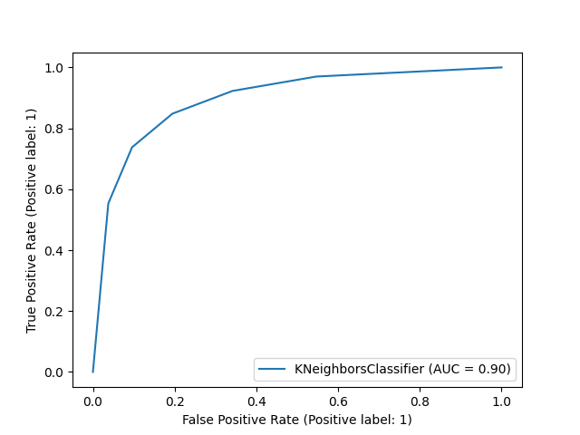
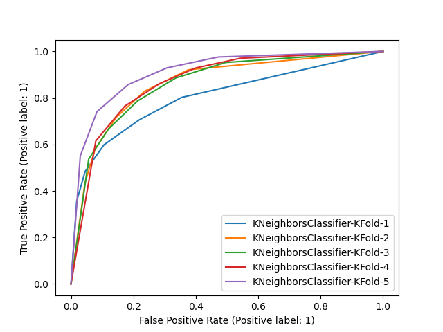
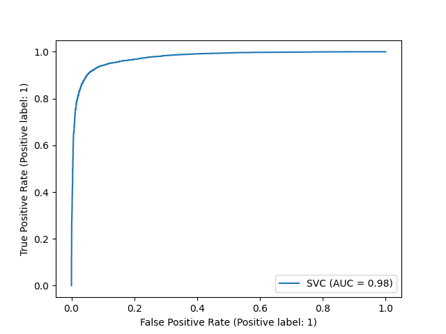
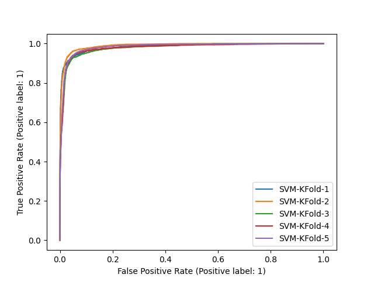

Ciência de Dados para Segurança (CI1030) - Trabalho Final
=================
#### Alunos:

Michael A Hempkemeyer (PPGINF-202000131795)

Roger R R Duarte (PPGINF-202000131793)

<hr >

#### Objetivo do trabalho:

Em nosso trabalho um Dataset relacionado a CVEs foi utilizado. CVE (_Common Vulnerabilities and Exposures_) é um referência pública de segurança da informação relacionada a vulnerabilidades e exposições.

Verificando os campos do Dataset, o objetivo traçado foi o mapeamento de quais CVE geraram impacto e quais não geraram sobre determinados tipos de ambientes, isso com base nas variáveis do Dataset. Caber ressaltar que qualquer tipo de impacto, seja parcial ou completo, foi considerado como positivo em nosso experimento. 

Na sequência deste relatório, são apresentados o Dataset e seus respectivos rótulos, informações a respeito do pré-processamento do Dataset, gráficos distribuição de classes, informações de treinamentos, testes e resultados obtidos com o processamento do Dataset utilizando os algoritmos RandomForest, Kneighbors e SVM.

<hr >

#### Dataset: 

O dataset possui um arquivo único com diversos JSONs (um por linha) com informações específicas de CVEs (_Common Vulnerabilities and Exposures_). Acesso ao dataset completo em https://www.kaggle.com/vsathiamoo/cve-common-vulnerabilities-and-exposures/version/1. Arquivo "circl-cve-search-expanded.json".

Verificou-se que o dataset possuía os seguintes campos:

    - Modified | tipo: date
    - Published | tipo: date
    - Access | tipo: dict { "authentication": 
                                "MULTIPLE_INSTANCES", "NONE" ou "SINGLE_INSTANCE",
                            "complexity":
                                "HIGH", "LOW" ou "MEDIUM", 
                            "vector":
                                "ADJACENT_NETWORK", "LOCAL" ou "NETWORK"
							}
    - Capec | tipo: list() | obs.: Common Attack Pattern Enumeration and Classification (CAPEC™)
    - Cvss | tipo: float
    - Cvss-time | tipo: date
    - Cwe | tipo: string
    - id (Cve-id) | tipo: string
    - Impact | tipo: dict  { "availability":
                                 "PARTIAL", "COMPLETE" ou "NONE", 
                             "confidentiality":
                                 "PARTIAL", "COMPLETE" ou "NONE", 
                             "integrity":
                                 "PARTIAL", "COMPLETE" OU "NONE"
							}
    - last-modified | tipo: date
    - Nessus | tipo: list() | obs.: Informação fornecida pelo site www.tenable.com, indica CVEs relacionados
    - References | tipo: list()
    - Summary | tipo: string
    - Vulnerable_configuration | tipo: list() | obs.: configuração do produto vulnerável
    - Vulnerable_configuration_cpe_2_2 | tipo: list() | obs.: configuração do produto vulnerável
	
Os campos cvss, cwe, access, impact, summary e vulnerable_configuration_cpe_2_2 foram utilizados em nosso trabalho, sendo eliminados os demais através do pré-processamento, conforme [Exploração de Dados / ](https://github.com/rogerduarte/CienciaDeDados/tree/main/Explora%C3%A7%C3%A3o%20de%20Dados).


<hr >

#### Pré-processamento:

O pré-processamento foi realizado através do Script Python [PreProcessamento.py](https://github.com/rogerduarte/CienciaDeDados/blob/main/Trabalho_Final/PreProcessamento.py), de forma a se obter informações de interesse do Dataset.

Foi realizada a leitura do arquivo JSON (Dataset completo) e apenas as colunas cvss, cwe, access, impact, summary e vulnerable_configuration_cpe_2_2 foram mantidas.

As colunas summary e cvss foram utilizadas como base para determinar quais linhas do dataset seriam mantidas, visto que a coluna summary em determinados momentos possuía a mensagem "** REJECT ** DO NOT USE THIS CANDIDATE NUMBER" e a coluna cvss (score) possuía itens em branco. Dessa forma, o seguinte trecho de código foi utilizado para essas duas colunas:

```python
	elif d == "cvss":
		# Não inclui no dataset pre-processado itens com cvss zerados
		if tmp[d] is None:
		use_line = False
		break
	else:
		tmp_dict[d] = tmp[d]
```
								

```python
	elif d == "summary":
		# Em determinados casos, existe a marcação de "REJECT" no summary.
		# Tais CVEs que contêm o REJECT no summary serão eliminados
		# Ex.: ** REJECT **  DO NOT USE THIS CANDIDATE NUMBER.  ConsultIDs: none.  Reason: This ...
		if ("** REJECT **" in tmp[d].upper() or
			"DO NOT USE THIS CANDIDATE NUMBER" in tmp[d].upper()):
			use_line = False
			break
		tmp_dict[d] = tmp[d].replace("\"", "'")
```		

Com a coluna summary, foi possível mapear quais CVEs geraram impacto e quais não geraram (objetivo do trabalho). O seguinte trecho de código possui os ajustes na coluna summary:

```python
	elif d == "impact":
		if ((d in tmp.keys()) and
			(tmp[d]["availability"] == "PARTIAL" or tmp[d]["availability"] == "COMPLETE") and
			(tmp[d]["confidentiality"] == "PARTIAL" or tmp[d]["confidentiality"] == "COMPLETE") and
			(tmp[d]["integrity"] == "PARTIAL" or tmp[d]["integrity"] == "COMPLETE")):
			tmp_dict["impact"] = 1
		else:
			tmp_dict["impact"] = 0	
```	

Com o trecho de código apresentado acima, a coluna summary que antes era um dicionário, foi mapeada para um valor binário, que indica se o CVE gera ou não impacto.

Para a coluna access, o seguinte tratamento foi realizado:

```python
	self.control_access = {
		"vector": {
			"ADJACENT_NETWORK": 1,
			"LOCAL": 2,
			"NETWORK": 3
		},
		"complexity": {
			"HIGH": 5,
			"LOW": 6,
			"MEDIUM": 7
		},
		"authentication": {
			"MULTIPLE_INSTANCES": 9,
			"NONE": 10,
		"SINGLE_INSTANCE": 11
		},
		"NotAvailable": 12
	}
	
```

```python
	elif d == "access":
		if d in tmp.keys():
			# Faz a categorização do access conforme variável self.access_control
			tmp_dict["access"] = self.control_access["vector"][tmp[d]["vector"]]
			tmp_dict["access"] += self.control_access["authentication"][tmp[d]["authentication"]]
			tmp_dict["access"] += self.control_access["complexity"][tmp[d]["complexity"]]
		else:
			tmp_dict["access"] = self.control_access["NotAvailable"]						
```


Com o trecho de código apresentado acima, a coluna access que antes era um dicionário, foi mapeada para um valor número. Isto foi realizado para facilitar o mapeamento posterior da característica.

O campo vulnerable_configuration_cpe_2_2, que possui informações a respeito da configuração do ambiente vulnerável, foi convertida de uma lista de strings para uma única string, conforme trecho de código abaixo:

```python
	elif d == "vulnerable_configuration_cpe_2_2":
		if type(tmp[d]) is list and len(tmp[d]) > 0:
			tmp_vc = ""
			for i in tmp[d]:
				tmp_vc = tmp_vc+";"+i
			tmp_dict[d] = tmp_vc
		else:
			tmp_dict[d] = "NotAvailable"
```

Como resultado final do script foram criados dois arquivos CVS pré-processados, um com uma porção de 80% dos dados e outra com 20%.

<hr >

#### Distribuição de classes:

Conforme saída do CSV de pré-processamento, foram criados dois gráficos com o mapa de distribuição de classes, com base no campo impact.

A seguir são apresentados os gráficos de distribuição de classe das porções de 20% e 80%.


<hr >

#### Treinamentos, testes e resultados:

Após o prévio processamento do dataset “circl-cve-search-expanded.json” – escolha das informações de interesse e divisão dos dados em dois grupos, um com 80% e o outro com 20% dos dados – foi realizado o treinamento do dataset com a porção de 80% das informações nos modelos RandomForest, Kneighborn e Support-vector machine (SVM). Para isso, além de outras bibliotecas, foram utilizadas a biblioteca de aprendizado de máquina scikit-learn e a biblioteca de criação de gráficos e visualizações de dados em geral Matplotlib, ambas para a linguagem de programação Python.
```python

import math
import sys
import time

import pandas as pd
import os

from gensim.models import Word2Vec
from sklearn.feature_extraction.text import TfidfVectorizer
from sklearn.model_selection import StratifiedKFold
from sklearn.preprocessing import MinMaxScaler
from sklearn.ensemble import RandomForestClassifier
from sklearn.metrics import confusion_matrix, precision_score, mean_absolute_error
import numpy as np
from sklearn.neighbors import KNeighborsClassifier
from sklearn.svm import SVC
import matplotlib.pyplot as plt
from sklearn.metrics import plot_roc_curve
```

O treinamento, teste e obtenção dos resultados foi realizado através do Script Python ["ImplementacaoModelos.py"]  (https://github.com/rogerduarte/CienciaDeDados/blob/main/Trabalho_Final/ImplementacaoModelos.py)
O referido Script irá gerar treinar, testar e gerar relatórios dos 3 modelos a seguir.

#### 1) RandonForest:
É um método de aprendizagem para classificação, regressão e outras tarefas que operam construindo uma infinidade de árvores de decisão, de maneira aleatória.

   a) treinamento/teste
A execução do método é inciada pela função “generate_models”, conforme abaixo

```python

def generate_models():
"""
Função principal para gerar os modelos e executá-los
.
.
.
# ****************************** RandomForestClassifier
execute_model(RandomForestClassifier(n_estimators=100), train_features_norm, train_label,
test_features_norm, test_label, model_name="RandomForestClassifier")
execute_kfold(RandomForestClassifier(n_estimators=100), train_features_norm, train_label, cv,
model_name="RandomForestClassifier-KFold")
.
.
.
````

   b) resultado split/resultado kfold/curva roc
Os resultados obtidos do split dos dados e do k-fold foi o seguinte:
```python
---------*--------- Split percentage (RandomForestClassifier) ---------*---------
Precisão: 0.9522465567848273
Erro (mean_absolute_error): 0.06926542360155175
Matriz de confusão: 
[[6440  423]
 [ 684 8435]]
---------*--------- Kfold (RandomForestClassifier-KFold) ---------*---------
Precisão: 0.9785809906291834
Erro (mean_absolute_error): 0.15165024245268263
Matriz de confusão: 
[[7923   64]
 [1875 2924]]
Precisão: 0.9644186046511628
Erro (mean_absolute_error): 0.06288619475948377
Matriz de confusão: 
[[7834  153]
 [ 651 4147]]
Precisão: 0.9263492063492064
Erro (mean_absolute_error): 0.06022682831443097
Matriz de confusão: 
[[7638  348]
 [ 422 4377]]
Precisão: 0.8430840759395584
Erro (mean_absolute_error): 0.09831834180680485
Matriz de confusão: 
[[7176  810]
 [ 447 4352]]
Precisão: 0.9326641572563781
Erro (mean_absolute_error): 0.0517012123582323
Matriz de confusão: 
[[7664  322]
 [ 339 4460]]
```
Já os gráficos das curvas ROC obtidas foram as seguintes:


   c) discussão resultados

 #### 2) Kneighborn:

   a) treinamento/teste
A execução do método é inciada pela função “generate_models”, conforme abaixo

```python

def generate_models():
"""
Função principal para gerar os modelos e executá-los
.
.
.
# ****************************** "KNeighborsClassifier
execute_model(KNeighborsClassifier(n_neighbors=5), train_features_norm, train_label, test_features_norm, test_label,
model_name="KNeighborsClassifier")
execute_kfold(KNeighborsClassifier(n_neighbors=5), train_features_norm, train_label, cv,
model_name="KNeighborsClassifier-KFold")
.
.
.
```

   b) resultado split/resultado kfold/curva roc
Os resultados obtidos do split dos dados e do k-fold foi o seguinte:
```python
---------*--------- Split percentage (KNeighborsClassifier) ---------*---------
Precisão: 0.8527952365200132
Erro (mean_absolute_error): 0.17019146539857338
Matriz de confusão: 
[[5528 1335]
 [1385 7734]]
---------*--------- Kfold (KNeighborsClassifier-KFold) ---------*---------
Precisão: 0.772666128598332
Erro (mean_absolute_error): 0.21679962458939464
Matriz de confusão: 
[[7142  845]
 [1927 2872]]
Precisão: 0.7485303723056825
Erro (mean_absolute_error): 0.19671490027375832
Matriz de confusão: 
[[6832 1155]
 [1360 3438]]
Precisão: 0.6890955506929248
Erro (mean_absolute_error): 0.21314039890496675
Matriz de confusão: 
[[6281 1705]
 [1020 3779]]
Precisão: 0.6462404251993121
Erro (mean_absolute_error): 0.22901838091513493
Matriz de confusão: 
[[5723 2263]
 [ 665 4134]]
Precisão: 0.7380696088984571
Erro (mean_absolute_error): 0.167774736018772
Matriz de confusão: 
[[6526 1460]
 [ 685 4114]]
```

Já os gráficos das curvas ROC obtidas foram as seguintes:





   c) discussão resultados


#### 3) SVM:

   a) treinamento/teste
A execução do método é inciada pela função “generate_models”, conforme abaixo

```python

def generate_models():
"""
Função principal para gerar os modelos e executá-los
.
.
.
# ****************************** SVM
execute_model(SVC(kernel="linear"), train_features_norm, train_label, test_features_norm, test_label,
model_name="SVM")
execute_kfold(SVC(kernel="linear"), train_features_norm, train_label, cv,
model_name="SVM-KFold")
.
.
.
```

   b) resultado split/resultado kfold/curva roc
Os resultados obtidos do split dos dados e do k-fold foi o seguinte:
```python
---------*--------- Split percentage (SVM) ---------*---------
Precisão: 0.9357778021736743
Erro (mean_absolute_error): 0.07383306219496934
Matriz de confusão: 
[[6278  585]
 [ 595 8524]]
---------*--------- Kfold (SVM-KFold) ---------*---------
Precisão: 0.9773958088062161
Erro (mean_absolute_error): 0.058188643829188175
Matriz de confusão: 
[[7891   96]
 [ 648 4151]]
Precisão: 0.9608619173262972
Erro (mean_absolute_error): 0.04739929605005866
Matriz de confusão: 
[[7809  178]
 [ 428 4370]]
Precisão: 0.8818022235225278
Erro (mean_absolute_error): 0.0691435275713727
Matriz de confusão: 
[[7380  606]
 [ 278 4521]]
Precisão: 0.9055588762701734
Erro (mean_absolute_error): 0.056941728588189286
Matriz de confusão: 
[[7512  474]
 [ 254 4545]]
Precisão: 0.8898780723824269
Erro (mean_absolute_error): 0.06022682831443097
Matriz de confusão: 
[[7417  569]
 [ 201 4598]]
```

Já os gráficos das curvas ROC obtidas foram as seguintes:





   c) discussão resultados
Tempo total: Runtime of the program is 4922.091492176056s


<hr >
#### 1) RandonForest:

   a) treinamento/teste


   b) resultado split/resultado kfold/curva roc


   c) discussão resultados


####  2) Kneighborn:

   a) treinamento/teste


   b) resultado split/resultado kfold/curva roc


   c) discussão resultados


####  3) SVM:

   a) treinamento/teste


   b) resultado split/resultado kfold/curva roc


   c) discussão resultados

