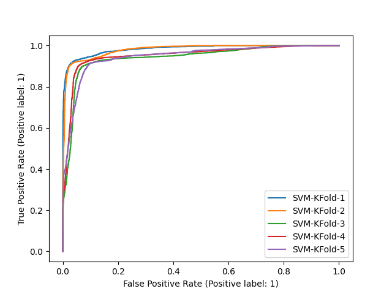
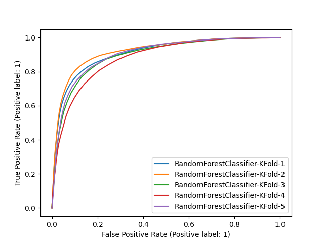

Ciência de Dados para Segurança (CI1030) - Trabalho Final
=================
#### Alunos:

Michael A Hempkemeyer (PPGINF-202000131795)

Roger R R Duarte (PPGINF-202000131793)

<hr >

#### Objetivo do trabalho:

Em nosso trabalho um Dataset relacionado a CVEs foi utilizado. CVE (_Common Vulnerabilities and Exposures_) é um referência pública de segurança da informação relacionada a vulnerabilidades e exposições.

Verificando os campos do Dataset, o objetivo traçado foi o mapeamento de quais CVE geraram impacto e quais não geraram sobre determinados tipos de ambientes, isso com base nas variáveis do Dataset. Caber ressaltar que qualquer tipo de impacto, seja parcial ou completo, foi considerado como positivo em nosso experimento. 

Na sequência deste relatório, são apresentados o Dataset e seus respectivos rótulos, informações a respeito do pré-processamento do Dataset, gráficos distribuição de classes, informações de treinamentos, testes e resultados obtidos com o processamento do Dataset utilizando os algoritmos RandomForest, Kneighbors e SVM.

<hr >

#### Dataset: 

O dataset possui um arquivo único com diversos JSONs (um por linha) com informações específicas de CVEs (_Common Vulnerabilities and Exposures_). Acesso ao dataset completo em https://www.kaggle.com/vsathiamoo/cve-common-vulnerabilities-and-exposures/version/1. Arquivo "circl-cve-search-expanded.json".

Verificou-se que o dataset possuía os seguintes campos:

    - Modified | tipo: date
    - Published | tipo: date
    - Access | tipo: dict { "authentication": 
                                "MULTIPLE_INSTANCES", "NONE" ou "SINGLE_INSTANCE",
                            "complexity":
                                "HIGH", "LOW" ou "MEDIUM", 
                            "vector":
                                "ADJACENT_NETWORK", "LOCAL" ou "NETWORK"
							}
    - Capec | tipo: list() | obs.: Common Attack Pattern Enumeration and Classification (CAPEC™)
    - Cvss | tipo: float
    - Cvss-time | tipo: date
    - Cwe | tipo: string
    - id (Cve-id) | tipo: string
    - Impact | tipo: dict  { "availability":
                                 "PARTIAL", "COMPLETE" ou "NONE", 
                             "confidentiality":
                                 "PARTIAL", "COMPLETE" ou "NONE", 
                             "integrity":
                                 "PARTIAL", "COMPLETE" OU "NONE"
							}
    - last-modified | tipo: date
    - Nessus | tipo: list() | obs.: Informação fornecida pelo site www.tenable.com, indica CVEs relacionados
    - References | tipo: list()
    - Summary | tipo: string
    - Vulnerable_configuration | tipo: list() | obs.: configuração do produto vulnerável
    - Vulnerable_configuration_cpe_2_2 | tipo: list() | obs.: configuração do produto vulnerável
	
Os campos cvss, cwe, access, impact, summary e vulnerable_configuration_cpe_2_2 foram utilizados em nosso trabalho, sendo eliminados os demais através do pré-processamento, conforme [Exploração de Dados / ](https://github.com/rogerduarte/CienciaDeDados/tree/main/Explora%C3%A7%C3%A3o%20de%20Dados).


<hr >

#### Pré-processamento:

O pré-processamento foi realizado através do Script Python [PreProcessamento.py](https://github.com/rogerduarte/CienciaDeDados/blob/main/Trabalho_Final/PreProcessamento.py), de forma a se obter informações de interesse do Dataset.

Foi realizada a leitura do arquivo JSON (Dataset completo) e apenas as colunas cvss, cwe, access, impact, summary e vulnerable_configuration_cpe_2_2 foram mantidas.

As colunas summary e cvss foram utilizadas como base para determinar quais linhas do dataset seriam mantidas, visto que a coluna summary em determinados momentos possuía a mensagem "** REJECT ** DO NOT USE THIS CANDIDATE NUMBER" e a coluna cvss (score) possuía itens em branco. Dessa forma, o seguinte trecho de código foi utilizado para essas duas colunas:


```python
	(...)
	elif d == "cvss":
		# Não inclui no dataset pre-processado itens com cvss zerados
		if tmp[d] is None:
		use_line = False
		break
	else:
		tmp_dict[d] = tmp[d]
	(...)
```
								

```python
	(...)
	elif d == "summary":
		# Em determinados casos, existe a marcação de "REJECT" no summary.
		# Tais CVEs que contêm o REJECT no summary serão eliminados
		# Ex.: ** REJECT **  DO NOT USE THIS CANDIDATE NUMBER.  ConsultIDs: none.  Reason: This ...
		if ("** REJECT **" in tmp[d].upper() or
			"DO NOT USE THIS CANDIDATE NUMBER" in tmp[d].upper()):
			use_line = False
			break
		tmp_dict[d] = tmp[d].replace("\"", "'")
	(...)
```		

Com a coluna summary foi possível mapear quais CVEs geraram impacto e quais não geraram (objetivo do trabalho). O seguinte trecho de código possui os ajustes na coluna summary:

```python
	(...)
	elif d == "impact":
		if ((d in tmp.keys()) and
			(tmp[d]["availability"] == "PARTIAL" or tmp[d]["availability"] == "COMPLETE") and
			(tmp[d]["confidentiality"] == "PARTIAL" or tmp[d]["confidentiality"] == "COMPLETE") and
			(tmp[d]["integrity"] == "PARTIAL" or tmp[d]["integrity"] == "COMPLETE")):
			tmp_dict["impact"] = 1
		else:
			tmp_dict["impact"] = 0	
	(...)
```	

Com o trecho de código apresentado acima, a coluna summary, que antes era um dicionário, foi mapeada para um valor binário que indica se o CVE gera ou não impacto.

Para a coluna access, o seguinte tratamento foi realizado:

```python
	(...)
	self.control_access = {
		"vector": {
			"ADJACENT_NETWORK": 1,
			"LOCAL": 2,
			"NETWORK": 3
		},
		"complexity": {
			"HIGH": 5,
			"LOW": 6,
			"MEDIUM": 7
		},
		"authentication": {
			"MULTIPLE_INSTANCES": 9,
			"NONE": 10,
		"SINGLE_INSTANCE": 11
		},
		"NotAvailable": 12
	}
	(...)
```

```python
	(...)
	elif d == "access":
		if d in tmp.keys():
			# Faz a categorização do access conforme variável self.access_control
			tmp_dict["access"] = self.control_access["vector"][tmp[d]["vector"]]
			tmp_dict["access"] += self.control_access["authentication"][tmp[d]["authentication"]]
			tmp_dict["access"] += self.control_access["complexity"][tmp[d]["complexity"]]
		else:
			tmp_dict["access"] = self.control_access["NotAvailable"]						
	(...)
```


Com o trecho de código apresentado acima, a coluna access, que antes era um dicionário, foi mapeada para um valor número. Isto foi realizado para facilitar o mapeamento posterior da característica.

O campo vulnerable_configuration_cpe_2_2, que possui informações a respeito da configuração do ambiente vulnerável, foi convertida de uma lista de strings para uma única string, conforme trecho de código abaixo:

```python
	(...)
	elif d == "vulnerable_configuration_cpe_2_2":
		if type(tmp[d]) is list and len(tmp[d]) > 0:
			tmp_vc = ""
			for i in tmp[d]:
				tmp_vc = tmp_vc+";"+i
			tmp_dict[d] = tmp_vc
		else:
			tmp_dict[d] = "NotAvailable"
	(...)
```

Como resultado final do script foram criados dois arquivos CVS pré-processados, um com uma porção de 80% dos dados e outra com 20%.

<hr >

#### Distribuição de classes:

Conforme saída do CSV de pré-processamento, foram criados dois gráficos com o mapa de distribuição de classes com base no campo impact.

A seguir são apresentados os gráficos de distribuição de classe das porções de 20% e 80%.

<p float="left">
	 
	
<p/>

<hr >

#### Treinamentos, testes e resultados:

Após o prévio processamento do dataset “circl-cve-search-expanded.json” – escolha das informações de interesse e divisão dos dados em dois grupos, um com 80% e o outro com 20% dos dados – foi realizado o treinamento do dataset com a porção de 80% das informações nos modelos RandomForest, Kneighborn e Support-vector machine (SVM). Para isso, além de outras bibliotecas, foram utilizadas a biblioteca de aprendizado de máquina scikit-learn e a biblioteca de criação de gráficos e visualizações de dados Matplotlib, ambas para a linguagem de programação Python.
```python

import math
import sys
import time

import pandas as pd
import os

from gensim.models import Word2Vec
from sklearn.feature_extraction.text import TfidfVectorizer
from sklearn.model_selection import StratifiedKFold
from sklearn.preprocessing import MinMaxScaler
from sklearn.ensemble import RandomForestClassifier
from sklearn.metrics import confusion_matrix, precision_score, mean_absolute_error
import numpy as np
from sklearn.neighbors import KNeighborsClassifier
from sklearn.svm import SVC
import matplotlib.pyplot as plt
from sklearn.metrics import plot_roc_curve
```

O treinamento, o teste e a obtenção dos resultados foi realizado através do Script Python [ImplementacaoModelos.py](https://github.com/rogerduarte/CienciaDeDados/blob/main/Trabalho_Final/ImplementacaoModelos.py).
O referido Script irá treinar, testar e gerar os resultados dos 3 modelos a seguir.
Cabe resaltar que foram utilizados os seguintes sítios como referência para a implementação dos modelos mencionados:

Referências:

* https://github.com/fabriciojoc/ml-cybersecuritiy-course/
* https://scikit-learn.org/stable/modules/generated/sklearn.ensemble.RandomForestClassifier.html
* https://scikit-learn.org/stable/modules/generated/sklearn.neighbors.KNeighborsClassifier.html
* https://scikit-learn.org/stable/modules/generated/sklearn.svm.SVC.html

#### 1. RandonForest:

   **1.a. Treinamento/Teste:** 
   
   A execução do método é iniciada pela função “generate_models”, conforme abaixo.

```python
def generate_models():
(...)
# ****************************** RandomForestClassifier
execute_model(RandomForestClassifier(n_estimators=100), train_features_norm, train_label,
test_features_norm, test_label, model_name="RandomForestClassifier")
execute_kfold(RandomForestClassifier(n_estimators=100), train_features_norm, train_label, cv,
model_name="RandomForestClassifier-KFold")
(...)
````
Inicialmente é realizado a chamada do método "execute_model", o qual utiliza funções do scikit-learn para processar as informações passadas como parâmetros. Ao final do processamento, é realizado a geração da curva ROC (Receiver Operating Characteristic Curve - Curva Característica de Operação do Receptor) dos resultados obtidos, caso a variável de controle "generate_roc_curve" esteja ativada.

```python
(...)
from sklearn.metrics import confusion_matrix, precision_score, mean_absolute_error
(...)

def execute_model(model, train_features_norm, train_label, test_features_norm, test_label, model_name=""):
    global generate_roc_curve
    """
    Executa um modelo conforme parâmetros
    """
    if model_name == "RandomForestClassifier" or model_name == "KNeighborsClassifier" or model_name == "SVM":
        clf = model
        clf.fit(train_features_norm, train_label)
        test_pred = clf.predict(test_features_norm)
        print(f"---------*--------- Split percentage ({model_name}) ---------*---------")
        print(f"Precisão: ", end="")
        print(precision_score(test_label, test_pred))
        print(f"Erro (mean_absolute_error): ", end="")
        print(mean_absolute_error(test_label, test_pred))
        print(f"Matriz de confusão: ")
        print(confusion_matrix(test_label, test_pred))

        if generate_roc_curve is True:
            plot_roc_curve(clf, test_features_norm, test_label)
            plt.show()
```

Por fim, após o processamento dos dados no método mencionado acima, é realizado a chamada do método "execute_kfold", o qual irá realizar a validação cruzada dos dados. Ao final, irá também gerar os gráficos da curva ROC, caso a variável de controle esteja ativada.

```python
def execute_kfold(model, X, Y, cv, model_name=""):
    """
    Execução k-fold cross validation, k=cv
    """
    global generate_roc_curve

    """
    https://scikit-learn.org/stable/modules/generated/sklearn.model_selection.StratifiedKFold.html
    https://scikit-learn.org/stable/glossary.html#term-random_state
    """
    kf = StratifiedKFold(n_splits=cv, random_state=None)

    count = 1
    ax = plt.gca()

    print(f"---------*--------- Kfold ({model_name}) ---------*---------")
    for train_index, test_index in kf.split(X, Y):
        X_train, X_test = X[train_index], X[test_index]
        Y_train, Y_test = Y[train_index], Y[test_index]
        clf = model
        clf.fit(X_train, Y_train)
        pred_t = clf.predict(X_test)
        print(f"Precisão: ", end="")
        print(precision_score(Y_test, pred_t))
        print(f"Erro (mean_absolute_error): ", end="")
        print(mean_absolute_error(Y_test, pred_t))
        print(f"Matriz de confusão: ")
        print(confusion_matrix(Y_test, pred_t))

        if generate_roc_curve is True:
            plot_roc_curve(clf, X_test, Y_test, ax=ax, label=f"{model_name}-{count}")
            count += 1

    if generate_roc_curve is True:
        plt.show()
```

   **1.b. Resultado Split/Resultado K-Fold/Curva ROC:**
   
Os resultados obtidos do Split dos dados e do K-Fold foram os seguintes.

<table>
  <tr>
    <td colspan="3"><b><center>Split percentage (RandomForestClassifier)</center><b/></td>
  </tr>
  <tr>
    <td><b>Precisão</b></td>
    <td><b>Erro</b></td>
	<td><b>Matriz de confusão:</b></td>
  </tr>
  <tr>
    <td>0.9522465567848273</td>
    <td>0.06926542360155175</td>
	<td>[6440 423]<br />[684  8435]</td>
  </tr>
</table>

<table>
  <tr>
    <td colspan="6"><b><center>Kfold (RandomForestClassifier-KFold)</center><b/></td>
  </tr>
  <tr>
    <td><b>Precisão (kfold=1):</b></td>
	<td>0.9785809906291834</td>
    <td><b>Erro (kfold=1):</b></td>
	<td>0.15165024245268263</td>
	<td><b>Matriz de confusão: (kfold=1):</b></td>
	<td>[7923 64] <br />[1875 2924]</td>
  </tr>
  <tr>
	<td><b>Precisão (kfold=2):</b></td>
    <td>0.9644186046511628</td>
    <td><b>Erro (kfold=2):</b></td>
    <td>0.06288619475948377</td>
	<td><b>Matriz de confusão: (kfold=2):</b></td>
	<td>[7834 153]<br />[651  4147]</td>
  </tr>
  <tr>
	<td><b>Precisão (kfold=3):</b></td>
    <td>0.9263492063492064</td>
    <td><b>Erro (kfold=3):</b></td>
    <td>0.06022682831443097</td>
	<td><b>Matriz de confusão: (kfold=3):</b></td>
    <td>[7638 348]<br />[422  4377]</td>
  </tr>
  <tr>
	<td><b>Precisão (kfold=4):</b></td>
    <td>0.8430840759395584</td>
    <td><b>Erro (kfold=4):</b></td>
    <td>0.09831834180680485</td>
	<td><b>Matriz de confusão: (kfold=4):</b></td>
	<td>[7176 810]<br />[447  4352]</td>
  </tr>
	<td><b>Precisão (kfold=5):</b></td>
    <td>0.9326641572563781</td>
    <td><b>Erro (kfold=5):</b></td>
    <td>0.0517012123582323</td>
	<td><b>Matriz de confusão: (kfold=5):</b></td>
	<td>[7664 322]<br />[339  4460]</td>
  </tr>
</table>

Já os gráficos das curvas ROC obtidas foram as seguintes:

<p float="left">
	
	
<p/>

   **1.c. Discussão dos resultados:**
   
Conforme é possível observar nos resultados, o modelo "RandomForest" obteve uma precisão mínima de "0.8430840759395584" e máxima de "0.9785809906291834" no K-Fold. Já com o Split dos dados, a precisão foi de "0.9522465567848273". Já a média absoluta de erros variou de "0.0517012123582323" até "0.15165024245268263" no K-Fold e "0.06926542360155175" no Split dos dados. Esse resultado sugere que a precisão do modelo é expressivamene alta, considerando o tamanho do dataset e as informações utilizadas para as tomadas de decisão.

 #### 2. KNeighborsClassifier:

   **2.a. Treinamento/Teste:**
   
A execução do método é inciada pela função “generate_models”, conforme abaixo. As duas chamadas fazem menção aos métodos já descritos no item "1.a" do presente relatório.

```python

def generate_models():
(...)
# ****************************** "KNeighborsClassifier
execute_model(KNeighborsClassifier(n_neighbors=5), train_features_norm, train_label, test_features_norm, test_label,
model_name="KNeighborsClassifier")
execute_kfold(KNeighborsClassifier(n_neighbors=5), train_features_norm, train_label, cv,
model_name="KNeighborsClassifier-KFold")
(...)
```


   **2.b. Resultado Split/Resultado K-Fold/Curva ROC:**
   
Os resultados obtidos do Split dos dados e do K-Fold foram os seguintes.

```
---------*--------- Split percentage (KNeighborsClassifier) ---------*---------
Precisão: 0.8527952365200132
Erro (mean_absolute_error): 0.17019146539857338
Matriz de confusão: 
[[5528 1335]
 [1385 7734]]
---------*--------- Kfold (KNeighborsClassifier-KFold) ---------*---------
Precisão: 0.772666128598332
Erro (mean_absolute_error): 0.21679962458939464
Matriz de confusão: 
[[7142  845]
 [1927 2872]]
Precisão: 0.7485303723056825
Erro (mean_absolute_error): 0.19671490027375832
Matriz de confusão: 
[[6832 1155]
 [1360 3438]]
Precisão: 0.6890955506929248
Erro (mean_absolute_error): 0.21314039890496675
Matriz de confusão: 
[[6281 1705]
 [1020 3779]]
Precisão: 0.6462404251993121
Erro (mean_absolute_error): 0.22901838091513493
Matriz de confusão: 
[[5723 2263]
 [ 665 4134]]
Precisão: 0.7380696088984571
Erro (mean_absolute_error): 0.167774736018772
Matriz de confusão: 
[[6526 1460]
 [ 685 4114]]
```

Já os gráficos das curvas ROC obtidas foram as seguintes:

<p float="left">
	
	
<p/>

   **2.c. Discussão dos resultados:**
   
Conforme é possível observar nos resultados, o modelo "KNeighborsClassifier" obteve uma precisão mínima de "0.6462404251993121" e máxima de "0.772666128598332" no K-Fold. Já com o Split dos dados, a precisão foi de "0.8527952365200132". Já a média absoluta de erros variou de "0.167774736018772" até "0.22901838091513493" no K-Fold e "0.17019146539857338" no Split dos dados. Esse resultado sugere que a precisão do modelo é razoavél, considerando o tamanho do dataset e as informações utilizadas para as tomadas de decisão. Ainda, o resultado positivo do Split foi relativamente maior que o do K-Fold.

#### 3. SVM:

   **3.a. Treinamento/Teste:**
   
A execução do método é inciada pela função “generate_models”, conforme abaixo. As duas chamadas fazem menção aos métodos já descritos no item "1.a" do presente relatório.

```python
def generate_models():
(...)
# ****************************** SVM
execute_model(SVC(kernel="linear"), train_features_norm, train_label, test_features_norm, test_label,
model_name="SVM")
execute_kfold(SVC(kernel="linear"), train_features_norm, train_label, cv,
model_name="SVM-KFold")
(...)
```

   **3.b. Resultado Split/Resultado K-Fold/Curva ROC:**

Os resultados obtidos do Split dos dados e do K-Fold foram os seguintes.

```
---------*--------- Split percentage (SVM) ---------*---------
Precisão: 0.9357778021736743
Erro (mean_absolute_error): 0.07383306219496934
Matriz de confusão: 
[[6278  585]
 [ 595 8524]]
---------*--------- Kfold (SVM-KFold) ---------*---------
Precisão: 0.9773958088062161
Erro (mean_absolute_error): 0.058188643829188175
Matriz de confusão: 
[[7891   96]
 [ 648 4151]]
Precisão: 0.9608619173262972
Erro (mean_absolute_error): 0.04739929605005866
Matriz de confusão: 
[[7809  178]
 [ 428 4370]]
Precisão: 0.8818022235225278
Erro (mean_absolute_error): 0.0691435275713727
Matriz de confusão: 
[[7380  606]
 [ 278 4521]]
Precisão: 0.9055588762701734
Erro (mean_absolute_error): 0.056941728588189286
Matriz de confusão: 
[[7512  474]
 [ 254 4545]]
Precisão: 0.8898780723824269
Erro (mean_absolute_error): 0.06022682831443097
Matriz de confusão: 
[[7417  569]
 [ 201 4598]]
```

Já os gráficos das curvas ROC obtidas foram as seguintes:

<p float="left">
	
	
<p/>

   **3.c. Discussão dos resultados:**
   
Conforme é possível observar nos resultados, o modelo "SVM" obteve uma precisão mínima de "0.8818022235225278" e máxima de "0.9773958088062161" no K-Fold. Já com o Split dos dados, a precisão foi de "0.9357778021736743". Já a média absoluta de erros variou de "0.04739929605005866" até "0.0691435275713727" no K-Fold e "0.07383306219496934" no Split dos dados. Esse resultado sugere que a precisão do modelo é expressivamene alta, considerando o tamanho do dataset e as informações utilizadas para as tomadas de decisão. Ainda, em comparação com os outros 2 modelos já descritos, o SVM obteve as melhores médias.

Cumpre referir que o tempo total de execução de todo o processamntos dos modelos foi o seguinte:

- Tempo total: Runtime of the program is 4922.091492176056s

<hr >

Após o treinamento, os testes e a obteção de resultados dos modelos RandomForest, Kneighborn e Support-vector machine (SVM) para a porção dos 80% dos dados, foi realizado o processamento dos dados que estavam contidos na porção de 20% do dataset pré-processado. O objetivo é validar os modelos e comparar os resultados. Para isso, foi realizado a seguintes mudançs no código do Scrypt Python "ImplementacaoModelos.py"

- Antes:
```python
# Criação dos DataFrames conforme as porções de dados
df_data = pd.read_csv(data_path_80)
```
- Depois:
```python
# Criação dos DataFrames conforme as porções de dados
df_data = pd.read_csv(data_path_20)
```
#### 4. RandonForest:

   **4.a. Resultado Split/Resultado K-Fold/Curva ROC:**
   
Os resultados obtidos do Split dos dados e do K-Fold foram os seguintes.

```
---------*--------- Split percentage (RandomForestClassifier) ---------*---------
Precisão: 0.9552594002855783
Erro (mean_absolute_error): 0.05855855855855856
Matriz de confusão: 
[[1755   94]
 [ 140 2007]]
---------*--------- Kfold (RandomForestClassifier-KFold) ---------*---------
Precisão: 0.9547930283224401
Erro (mean_absolute_error): 0.04128870816390366
Matriz de confusão: 
[[1312   83]
 [  49 1753]]
Precisão: 0.948537378114843
Erro (mean_absolute_error): 0.045682102628285357
Matriz de confusão: 
[[1299   95]
 [  51 1751]]
Precisão: 0.8680306905370844
Erro (mean_absolute_error): 0.11357947434292866
Matriz de confusão: 
[[1136  258]
 [ 105 1697]]
Precisão: 0.9208754208754208
Erro (mean_absolute_error): 0.09449311639549436
Matriz de confusão: 
[[1253  141]
 [ 161 1641]]
Precisão: 0.9642651296829972
Erro (mean_absolute_error): 0.0597622027534418
Matriz de confusão: 
[[1332   62]
 [ 129 1673]]
```

Já os gráficos das curvas ROC obtidas foram as seguintes:

<p float="left">
	
	
<p/>

   **4.b. Discussão dos resultados:**
   
Conforme é possível observar nos resultados, o modelo "RandomForest" na porção dos 20% dos dados obteve uma precisão mínima de "0.8680306905370844" e máxima de "0.9642651296829972" no K-Fold. Já com o Split dos dados, a precisão foi de "0.9552594002855783". Já a média absoluta de erros variou de "0.04128870816390366" até "0.11357947434292866" no K-Fold e "0.05855855855855856" no Split dos dados. Esse resultado sugere que a manutenção da alta precisão do modelo, conforme foi obtido também na porção de 80% dos dados.


####  5. KNeighborsClassifier:

   **5.a. Resultado Split/Resultado K-Fold/Curva ROC:**
   
Os resultados obtidos do Split dos dados e do K-Fold foram os seguintes.

```
---------*--------- Split percentage (KNeighborsClassifier) ---------*---------
Precisão: 0.8224730631092868
Erro (mean_absolute_error): 0.22272272272272273
Matriz de confusão: 
[[1503  346]
 [ 544 1603]]
---------*--------- Kfold (KNeighborsClassifier-KFold) ---------*---------
Precisão: 0.8706624605678234
Erro (mean_absolute_error): 0.12261495151704724
Matriz de confusão: 
[[1149  246]
 [ 146 1656]]
Precisão: 0.8586497890295358
Erro (mean_absolute_error): 0.13829787234042554
Matriz de confusão: 
[[1126  268]
 [ 174 1628]]
Precisão: 0.7324324324324324
Erro (mean_absolute_error): 0.29474342928660824
Matriz de confusão: 
[[ 899  495]
 [ 447 1355]]
Precisão: 0.7650566487775791
Erro (mean_absolute_error): 0.2856695869837297
Matriz de confusão: 
[[1000  394]
 [ 519 1283]]
Precisão: 0.8252740167633784
Erro (mean_absolute_error): 0.24812265331664582
Matriz de confusão: 
[[1123  271]
 [ 522 1280]]
```

Já os gráficos das curvas ROC obtidas foram as seguintes:

<p float="left">
	
	
<p/>


   5.b. Discussão dos resultados:
   
Conforme é possível observar nos resultados, o modelo "KNeighborsClassifier" na porção dos 20% dos dados obteve uma precisão mínima de "0.7324324324324324" e máxima de "0.8706624605678234" no K-Fold. Já com o Split dos dados, a precisão foi de "0.8224730631092868". Já a média absoluta de erros variou de "0.12261495151704724" até "0.29474342928660824" no K-Fold e "0.22272272272272273" no Split dos dados. Esse resultado foi expresivamente melhor nessa porção dos dados comparada a primeira porção dos 80% dos dados.


####  6. SVM:

   6.a. Resultado Split/Resultado K-Fold/Curva ROC:
   
Os resultados obtidos do Split dos dados e do K-Fold foram os seguintes.

```
---------*--------- Split percentage (SVM) ---------*---------
Precisão: 0.9643527204502814
Erro (mean_absolute_error): 0.041791791791791794
Matriz de confusão: 
[[1773   76]
 [  91 2056]]
---------*--------- Kfold (SVM-KFold) ---------*---------
Precisão: 0.9533622559652929
Erro (mean_absolute_error): 0.04066312167657179
Matriz de confusão: 
[[1309   86]
 [  44 1758]]
Precisão: 0.9454643628509719
Erro (mean_absolute_error): 0.04755944931163955
Matriz de confusão: 
[[1293  101]
 [  51 1751]]
Precisão: 0.9258658008658008
Erro (mean_absolute_error): 0.07133917396745933
Matriz de confusão: 
[[1257  137]
 [  91 1711]]
Precisão: 0.9261707988980716
Erro (mean_absolute_error): 0.0797872340425532
Matriz de confusão: 
[[1260  134]
 [ 121 1681]]
Precisão: 0.9632606199770379
Erro (mean_absolute_error): 0.058823529411764705
Matriz de confusão: 
[[1330   64]
 [ 124 1678]]
```


Já os gráficos das curvas ROC obtidas foram as seguintes:

<p float="left">
	
	
<p/>

   **6.b. Discussão dos Resultados:**
   
Conforme é possível observar nos resultados, o modelo "SVM" na porção dos 20% dos dados obteve uma precisão mínima de "0.9258658008658008" e máxima de "0.9632606199770379" no K-Fold. Já com o Split dos dados, a precisão foi de "0.9643527204502814". Já a média absoluta de erros variou de "0.04066312167657179" até "0.0797872340425532" no K-Fold e "0.041791791791791794" no Split dos dados. Esse resultado foi expresivamente melhor nessa porção dos dados comparada a primeira porção dos 80% dos dados. Esse resultado sugere que a manutenção da alta precisão do modelo, conforme foi obtido também na porção de 80% dos dados. Além disso, a precisão mínima no processamento do K-Fold foi superior se comparado com a porção e 80% dos dados

Cumpre referir que o tempo total de execução de todo o processamntos dos modelos foi o seguinte:

- Tempo total: Runtime of the program is 428.8825192451477s

<hr >

Todos os resultados obtidos podem ser analisados em (https://github.com/rogerduarte/CienciaDeDados/tree/main/Trabalho_Final/Sa%C3%ADdas%20Processamentos)
