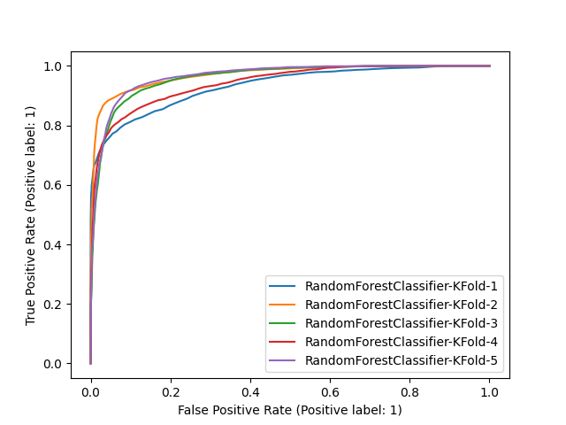

Ciência de Dados para Segurança (CI1030) - Trabalho Final
=================
#### Alunos:

Michael A Hempkemeyer (PPGINF-202000131795)

Roger R R Duarte (PPGINF-202000131793)

<hr >

#### Objetivo do trabalho:

Em nosso trabalho um Dataset relacionado a CVEs foi utilizado. CVE (_Common Vulnerabilities and Exposures_) é um referência pública de segurança da informação relacionada a vulnerabilidades e exposições.

Verificando os campos do Dataset, o objetivo traçado foi o mapeamento de quais CVE geraram impacto e quais não geraram sobre determinados tipos de ambientes, isso com base nas variáveis do Dataset. Caber ressaltar que qualquer tipo de impacto, seja parcial ou completo, foi considerado como positivo em nosso experimento. 

Na sequência deste relatório, são apresentados o Dataset e seus respectivos rótulos, informações a respeito do pré-processamento do Dataset, gráficos distribuição de classes, informações de treinamentos, testes e resultados obtidos com o processamento do Dataset utilizando os algoritmos RandomForest, Kneighbors e SVM.

<hr >

#### Dataset: 

O dataset possui um arquivo único com diversos JSONs (um por linha) com informações específicas de CVEs (_Common Vulnerabilities and Exposures_). Acesso ao dataset completo em https://www.kaggle.com/vsathiamoo/cve-common-vulnerabilities-and-exposures/version/1. Arquivo "circl-cve-search-expanded.json".

Verificou-se que o dataset possuía os seguintes campos:

    - Modified | tipo: date
    - Published | tipo: date
    - Access | tipo: dict { "authentication": 
                                "MULTIPLE_INSTANCES", "NONE" ou "SINGLE_INSTANCE",
                            "complexity":
                                "HIGH", "LOW" ou "MEDIUM", 
                            "vector":
                                "ADJACENT_NETWORK", "LOCAL" ou "NETWORK"
							}
    - Capec | tipo: list() | obs.: Common Attack Pattern Enumeration and Classification (CAPEC™)
    - Cvss | tipo: float
    - Cvss-time | tipo: date
    - Cwe | tipo: string
    - id (Cve-id) | tipo: string
    - Impact | tipo: dict  { "availability":
                                 "PARTIAL", "COMPLETE" ou "NONE", 
                             "confidentiality":
                                 "PARTIAL", "COMPLETE" ou "NONE", 
                             "integrity":
                                 "PARTIAL", "COMPLETE" OU "NONE"
							}
    - last-modified | tipo: date
    - Nessus | tipo: list() | obs.: Informação fornecida pelo site www.tenable.com, indica CVEs relacionados
    - References | tipo: list()
    - Summary | tipo: string
    - Vulnerable_configuration | tipo: list() | obs.: configuração do produto vulnerável
    - Vulnerable_configuration_cpe_2_2 | tipo: list() | obs.: configuração do produto vulnerável
	
Os campos cvss, cwe, access, impact, summary e vulnerable_configuration_cpe_2_2 foram utilizados em nosso trabalho, sendo eliminados os demais através do pré-processamento, conforme [Exploração de Dados / ](https://github.com/rogerduarte/CienciaDeDados/tree/main/Explora%C3%A7%C3%A3o%20de%20Dados).


<hr >

#### Pré-processamento:

O pré-processamento foi realizado através do Script Python [PreProcessamento.py](https://github.com/rogerduarte/CienciaDeDados/blob/main/Trabalho_Final/PreProcessamento.py), de forma a se obter informações de interesse do Dataset.

Foi realizada a leitura do arquivo JSON (Dataset completo) e apenas as colunas cvss, cwe, access, impact, summary e vulnerable_configuration_cpe_2_2 foram mantidas.

As colunas summary e cvss foram utilizadas como base para determinar quais linhas do dataset seriam mantidas, visto que a coluna summary em determinados momentos possuía a mensagem "** REJECT ** DO NOT USE THIS CANDIDATE NUMBER" e a coluna cvss (score) possuía itens em branco. Dessa forma, o seguinte trecho de código foi utilizado para essas duas colunas:


```python
	(...)
	elif d == "cvss":
		# Não inclui no dataset pre-processado itens com cvss zerados
		if tmp[d] is None:
		use_line = False
		break
	else:
		tmp_dict[d] = tmp[d]
	(...)
```
								

```python
	(...)
	elif d == "summary":
		# Em determinados casos, existe a marcação de "REJECT" no summary.
		# Tais CVEs que contêm o REJECT no summary serão eliminados
		# Ex.: ** REJECT **  DO NOT USE THIS CANDIDATE NUMBER.  ConsultIDs: none.  Reason: This ...
		if ("** REJECT **" in tmp[d].upper() or
			"DO NOT USE THIS CANDIDATE NUMBER" in tmp[d].upper()):
			use_line = False
			break
		tmp_dict[d] = tmp[d].replace("\"", "'")
	(...)
```		

Com a coluna summary foi possível mapear quais CVEs geraram impacto e quais não geraram (objetivo do trabalho). O seguinte trecho de código possui os ajustes na coluna summary:

```python
	(...)
	elif d == "impact":
		if ((d in tmp.keys()) and
			(tmp[d]["availability"] == "PARTIAL" or tmp[d]["availability"] == "COMPLETE") and
			(tmp[d]["confidentiality"] == "PARTIAL" or tmp[d]["confidentiality"] == "COMPLETE") and
			(tmp[d]["integrity"] == "PARTIAL" or tmp[d]["integrity"] == "COMPLETE")):
			tmp_dict["impact"] = 1
		else:
			tmp_dict["impact"] = 0	
	(...)
```	

Com o trecho de código apresentado acima, a coluna summary, que antes era um dicionário, foi mapeada para um valor binário que indica se o CVE gera ou não impacto.

Para a coluna access, o seguinte tratamento foi realizado:

```python
	(...)
	self.control_access = {
		"vector": {
			"ADJACENT_NETWORK": 1,
			"LOCAL": 2,
			"NETWORK": 3
		},
		"complexity": {
			"HIGH": 5,
			"LOW": 6,
			"MEDIUM": 7
		},
		"authentication": {
			"MULTIPLE_INSTANCES": 9,
			"NONE": 10,
		"SINGLE_INSTANCE": 11
		},
		"NotAvailable": 12
	}
	(...)
```

```python
	(...)
	elif d == "access":
		if d in tmp.keys():
			# Faz a categorização do access conforme variável self.access_control
			tmp_dict["access"] = self.control_access["vector"][tmp[d]["vector"]]
			tmp_dict["access"] += self.control_access["authentication"][tmp[d]["authentication"]]
			tmp_dict["access"] += self.control_access["complexity"][tmp[d]["complexity"]]
		else:
			tmp_dict["access"] = self.control_access["NotAvailable"]						
	(...)
```


Com o trecho de código apresentado acima, a coluna access, que antes era um dicionário, foi mapeada para um valor número. Isto foi realizado para facilitar o mapeamento posterior da característica.

O campo vulnerable_configuration_cpe_2_2, que possui informações a respeito da configuração do ambiente vulnerável, foi convertida de uma lista de strings para uma única string, conforme trecho de código abaixo:

```python
	(...)
	elif d == "vulnerable_configuration_cpe_2_2":
		if type(tmp[d]) is list and len(tmp[d]) > 0:
			tmp_vc = ""
			for i in tmp[d]:
				tmp_vc = tmp_vc+";"+i
			tmp_dict[d] = tmp_vc
		else:
			tmp_dict[d] = "NotAvailable"
	(...)
```

Como resultado final do script foram criados dois arquivos CVS pré-processados, um com uma porção de 80% dos dados e outra com 20%.

<hr >

#### Distribuição de classes:

Conforme saída do CSV de pré-processamento, foram criados dois gráficos com o mapa de distribuição de classes com base no campo impact.

A seguir são apresentados os gráficos de distribuição de classe das porções de 20% e 80%.

<p float="left">
	 
	
<p/>

<hr >

#### Treinamentos, testes e resultados:

Após o prévio processamento do dataset “circl-cve-search-expanded.json” – escolha das informações de interesse e divisão dos dados em dois grupos, um com 80% e o outro com 20% dos dados – foi realizado o treinamento do dataset com a porção de 80% das informações nos modelos RandomForest, Kneighborn e Support-vector machine (SVM). Para isso, além de outras bibliotecas, foram utilizadas a biblioteca de aprendizado de máquina scikit-learn 0.24.1 e a biblioteca de criação de gráficos e visualizações de dados Matplotlib 3.3.4, ambas para a linguagem de programação Python.
```python

import math
import sys
import time

import pandas as pd
import os

from gensim.models import Word2Vec
from sklearn.feature_extraction.text import TfidfVectorizer
from sklearn.model_selection import StratifiedKFold
from sklearn.preprocessing import MinMaxScaler
from sklearn.ensemble import RandomForestClassifier
from sklearn.metrics import confusion_matrix, precision_score, mean_absolute_error
import numpy as np
from sklearn.neighbors import KNeighborsClassifier
from sklearn.svm import SVC
import matplotlib.pyplot as plt
from sklearn.metrics import plot_roc_curve
from joblib import dump, load
import shutil
```

O treinamento, o teste e a obtenção dos resultados foi realizado através do Script Python [ImplementacaoModelos.py](https://github.com/rogerduarte/CienciaDeDados/blob/main/Trabalho_Final/ImplementacaoModelos.py).
O referido Script irá treinar, testar e gerar os resultados dos 3 modelos a seguir.

- Para o tratamento das características textuais foram utilizadas os métodos TDF-IDF e Word2Vec, conforme o código abaixo:
```python
    # Faz o tratamento das características textuais e já faz a junção com os numéricos
    for a in textual_attributes:
        # TDF-IDF
        train_texts, test_texts = textual_feature_tfid(train_data[a].values, test_data[a].values)
        train_features = np.concatenate((train_features, train_texts.toarray()), axis=1)
        test_features = np.concatenate((test_features, test_texts.toarray()), axis=1)
        # Word2Vec
        train_texts, test_texts = textual_feature_word2vec(train_data[a].values, test_data[a].values)
        train_features = np.concatenate((train_features, train_texts), axis=1)
        test_features = np.concatenate((test_features, test_texts), axis=1)
```
Além disso, antes de iniciar as chamadas do processamento do modelos é realizado a normalização dos dados com o código abaixo:

```python

    # Faz a normalização
    scaler_param = MinMaxScaler()
    scaler_param.fit(train_features)
    train_features_norm = scaler_param.transform(train_features)
    test_features_norm = scaler_param.transform(test_features)
```

Cabe ressaltar que foram utilizados os seguintes sítios como referência para a implementação dos modelos mencionados:

Referências:

* https://github.com/fabriciojoc/ml-cybersecuritiy-course/
* https://scikit-learn.org/stable/modules/generated/sklearn.ensemble.RandomForestClassifier.html
* https://scikit-learn.org/stable/modules/generated/sklearn.neighbors.KNeighborsClassifier.html
* https://scikit-learn.org/stable/modules/generated/sklearn.svm.SVC.html

#### 1. RandomForest:

   **1.a. Treinamento/Teste:** 
   
   A execução do método é iniciada pela função “generate_models”, conforme abaixo.
   Os parâmetros utilizados foram os seguintes:
   
   **- execute_model:**
   
   	* RandomForestClassifier(n_estimators=100): Determina o número de árvores na floresta de decisão. Foi utilizado a opção "n_estimators=100" apenas para deixar explícito, pois o valor é o padrão.
	* train_features_norm: dados de treino obtidos através do processo de normalização.
	* train_label: informação obtida pelo método "split_data". Classe utilizada para treino.
	* test_features_norm: dados de teste obtidos através do processo de normalização.
	* test_label: informação obtida pelo método "split_data". Classe utilizada para teste.
	* model_name: Nome do modelo que será utilizado posteriormente.
	
   **- execute_kfold:**
   
	* RandomForestClassifier(n_estimators=100): Determina o número de árvores na floresta de decisão. Foi utilizado a opção "n_estimators=100" apenas para deixar explícito, pois o valor é o padrão.
	* train_features_norm: dados de treino obtidos através do processo de normalização.
	* train_label: informação obtida pelo método "split_data". Classe utilizada para treino.
	* cv: valor do Cross Validation que será utilizado no processo do K-Fold.
	* model_name: Nome do modelo que será utilizado posteriormente.

```python
def generate_models():
(...)
# ****************************** RandomForestClassifier
execute_model(RandomForestClassifier(n_estimators=100), train_features_norm, train_label,
             test_features_norm, test_label, model_name="RandomForestClassifier")
execute_kfold(RandomForestClassifier(n_estimators=100), train_features_norm, train_label, cv,
             model_name="RandomForestClassifier-KFold")
(...)

````
Inicialmente é realizado a chamada do método "execute_model", o qual utiliza funções do scikit-learn para processar as informações passadas como parâmetros. Ao final do processamento, é realizado a geração da curva ROC (Receiver Operating Characteristic Curve - Curva Característica de Operação do Receptor) dos resultados obtidos, caso a variável de controle "generate_roc_curve" esteja ativada. Cabe mencionar que essa função também salva o modelo treinado através da chamada do método "dump(...)"

```python
(...)
from sklearn.metrics import confusion_matrix, precision_score, mean_absolute_error
(...)

def execute_model(model, train_features_norm, train_label, test_features_norm, test_label, model_name=""):
    global generate_roc_curve
    """
    Executa um modelo conforme parâmetros
    """
    if model_name == "RandomForestClassifier" or model_name == "KNeighborsClassifier" or model_name == "SVM":
        print(f"---------*--------- Split percentage ({model_name}) ---------*---------")
        clf = model
        clf.fit(train_features_norm, train_label)
        # Salvo o modelo treinado
        dump(clf, output_model_split[model_name])
        # Predição
        test_pred = clf.predict(test_features_norm)
        print(f"Precisão: ", end="")
        print(precision_score(test_label, test_pred))
        print(f"Erro (mean_absolute_error): ", end="")
        print(mean_absolute_error(test_label, test_pred))
        print(f"Matriz de confusão: ")
        print(confusion_matrix(test_label, test_pred))

        if generate_roc_curve is True:
            plot_roc_curve(clf, test_features_norm, test_label)
            plt.show()
```

Por fim, após o processamento dos dados no método mencionado acima, é realizado a chamada do método "execute_kfold", o qual irá realizar a validação cruzada dos dados. Ao final, irá também gerar os gráficos da curva ROC, caso a variável de controle esteja ativada. Cabe mencionar que essa função também salva o modelo treinado através da chamada do método "dump(...)"

```python
def execute_kfold(model, X, Y, cv, model_name=""):
    """
    Execução k-fold cross validation, k=cv
    """
    global generate_roc_curve

    """
    https://scikit-learn.org/stable/modules/generated/sklearn.model_selection.StratifiedKFold.html
    https://scikit-learn.org/stable/glossary.html#term-random_state
    """
    kf = StratifiedKFold(n_splits=cv, random_state=None)

    count = 1
    ax = plt.gca()
    idx = 0

    print(f"---------*--------- Kfold ({model_name}) ---------*---------")
    for train_index, test_index in kf.split(X, Y):
        X_train, X_test = X[train_index], X[test_index]
        Y_train, Y_test = Y[train_index], Y[test_index]
        clf = model
        clf.fit(X_train, Y_train)
        dump(clf, output_model_kfold[model_name][idx])
        idx += 1
        pred_t = clf.predict(X_test)
        print(f"Precisão: ", end="")
        print(precision_score(Y_test, pred_t))
        print(f"Erro (mean_absolute_error): ", end="")
        print(mean_absolute_error(Y_test, pred_t))
        print(f"Matriz de confusão: ")
        print(confusion_matrix(Y_test, pred_t))

        if generate_roc_curve is True:
            plot_roc_curve(clf, X_test, Y_test, ax=ax, label=f"{model_name}-{count}")
            count += 1

    if generate_roc_curve is True:
        plt.show()
```

   **1.b. Resultado Split/Resultado K-Fold/Curva ROC:**
   
Os resultados obtidos do Split dos dados e do K-Fold foram os seguintes.

<table>
  <tr>
    <td colspan="3" style="width:100%;align=center"><b>Split percentage (RandomForestClassifier)<b/></td>
  </tr>
  <tr>
    <td><b>Precisão</b></td>
    <td><b>Erro (mean_absolute_error)</b></td>
	<td><b>Matriz de confusão:</b></td>
  </tr>
  <tr>
    <td>0.930338389731622</td>
    <td>0.1090601927168064</td>
	<td>[6266  597]<br />[1146 7973]</td>
  </tr>
</table>

<table>
  <tr>
    <td colspan="4" style="width:100%;align=center"><b>K-Folds cross-validator (RandomForestClassifier)<b/></td>
  </tr>
  <tr>
    <td><b>K-Fold</b></td>
    <td><b>Precisão</b></td>
    <td><b>Erro (mean_absolute_error)</b></td>
	<td><b>Matriz de confusão:</b></td>
  </tr>
  <tr>
	<td>1</td>
    <td>0.9697966507177034</td>
    <td>0.12959486938839357</td>
	<td>[7886  101] <br />[1556 3243]</td>
  </tr>
  <tr>
	<td>2</td>
    <td>0.9623915139826422</td>
    <td>0.07524442706296441</td>
	<td>[7831  156]<br />[806 3992]</td>
  </tr>
  <tr>
	<td>3</td>
    <td>0.8889611797874648</td>
    <td>0.09479859210011732</td>
	<td>[7474  512]<br />[700 4099]</td>
  </tr>
  <tr>
	<td>4</td>
    <td>0.7716535433070866</td>
    <td>0.14329292139225655</td>
	<td>[6739 1247]<br />[585  4214]</td>
  </tr>
  <tr>
	<td>5</td>
    <td>0.8881856540084389</td>
    <td>0.08752444270629645</td>
	<td>[7456 530]<br />[589  4210]</td>
  </tr>
</table>

Já os gráficos das curvas ROC obtidas foram as seguintes:

<p float="left">
	 
	
<p/>

   **1.c. Discussão dos resultados:**
   
Conforme é possível observar nos resultados, o modelo "RandomForest" obteve uma precisão mínima de "0.7716535433070866" e máxima de "0.9697966507177034" no K-Fold. Já com o Split dos dados, a precisão foi de "0.930338389731622". Já a média absoluta de erros variou de "0.07524442706296441" até "0.14329292139225655" no K-Fold e "0.1090601927168064" no Split dos dados. Esse resultado sugere que a precisão do modelo é alta, considerando o tamanho do dataset e as informações utilizadas para as tomadas de decisão.

 #### 2. KNeighborsClassifier:

   **2.a. Treinamento/Teste:**
   
A execução do método é inciada pela função “generate_models”, conforme abaixo. As duas chamadas fazem menção aos métodos já descritos no item "1.a" do presente relatório.
   Os parâmetros utilizados foram os seguintes:
   
   **- execute_model**
   
	* KNeighborsClassifier(n_neighbors=5): determina o número de vizinhos. Foi utilizado a opção "n_neighbors=5" apenas para deixar explícito, pois o valor é o padrão.
	* train_features_norm: dados de treino obtidos através do processo de normalização.
	* train_label: informação obtida pelo método "split_data". Classe utilizada para treino.
	* test_features_norm: dados de teste obtidos através do processo de normalização.
	* test_label: informação obtida pelo método "split_data". Classe utilizada para teste.
	* model_name: Nome do modelo que será utilizado posteriormente.
	
   **- execute_kfold**
   
	* KNeighborsClassifier(n_neighbors=5): determina o número de vizinhos. Foi utilizado a opção "n_neighbors=5" apenas para deixar explícito, pois o valor é o padrão.
	* train_features_norm: dados de treino obtidos através do processo de normalização.
	* train_label: informação obtida pelo método "split_data". Classe utilizada para treino.
	* cv: valor do Cross Validation que será utilizado no processo do K-Fold.
	* model_name: Nome do modelo que será utilizado posteriormente.
	
```python

def generate_models():
(...)
# ****************************** "KNeighborsClassifier
execute_model(KNeighborsClassifier(n_neighbors=5), train_features_norm, train_label, test_features_norm, test_label,
				model_name="KNeighborsClassifier")
execute_kfold(KNeighborsClassifier(n_neighbors=5), train_features_norm, train_label, cv,
				model_name="KNeighborsClassifier-KFold")
(...)
```


   **2.b. Resultado Split/Resultado K-Fold/Curva ROC:**
   
Os resultados obtidos do Split dos dados e do K-Fold foram os seguintes.

<table>
  <tr>
    <td colspan="3" style="width:100%;align=center"><b>Split percentage (KNeighborsClassifier)<b/></td>
  </tr>
  <tr>
    <td><b>Precisão</b></td>
    <td><b>Erro (mean_absolute_error)</b></td>
	<td><b>Matriz de confusão:</b></td>
  </tr>
  <tr>
    <td>0.7862013174621518</td>
    <td>0.26066825178325614</td>
	<td>[5013 1850]<br />[2316 6803]</td>
  </tr>
</table>

<table>
  <tr>
    <td colspan="4" style="width:100%;align=center"><b>K-Folds cross-validator (KNeighborsClassifier)<b/></td>
  </tr>
  <tr>
    <td><b>K-Fold</b></td>
    <td><b>Precisão</b></td>
    <td><b>Erro (mean_absolute_error)</b></td>
	<td><b>Matriz de confusão:</b></td>
  </tr>
  <tr>
	<td>1</td>
    <td>0.7855846512833808</td>
    <td>0.20303456905990927</td>
	<td>[7160  827]<br />[1769 3030]</td>
  </tr>
  <tr>
	<td>2</td>
    <td>0.7542561065877128</td>
    <td>0.2140789988267501</td>
	<td>[6991 996]<br />[1741 3057]</td>
  </tr>
  <tr>
	<td>3</td>
    <td>0.6498940677966102</td>
    <td>0.24254986312084473</td>
	<td>[6003 1983]<br />[1118 3681]</td>
  </tr>
  <tr>
	<td>4</td>
    <td> 0.5999106611078022</td>
    <td>0.2703949941337505</td>
	<td>[5299 2687]<br />[770  4029]</td>
  </tr>
  <tr>
	<td>5</td>
    <td> 0.6753698868581375</td>
    <td>0.21775518185373485</td>
	<td>[6121 1865]<br />[919  3880]</td>
  </tr>
</table>


Já os gráficos das curvas ROC obtidas foram as seguintes:

<p float="left">
	
	
<p/>

   **2.c. Discussão dos resultados:**
   
Conforme é possível observar nos resultados, o modelo "KNeighborsClassifier" obteve uma precisão mínima de "0.5999106611078022" e máxima de "0.7855846512833808" no K-Fold. Já com o Split dos dados, a precisão foi de "0.7862013174621518". Já a média absoluta de erros variou de "0.20303456905990927" até "0.2703949941337505" no K-Fold e "0.26066825178325614" no Split dos dados. Esse resultado sugere que a precisão do modelo é razoavelmente baixa.

#### 3. SVM:

   **3.a. Treinamento/Teste:**
   
A execução do método é inciada pela função “generate_models”, conforme abaixo. As duas chamadas fazem menção aos métodos já descritos no item "1.a" do presente relatório.
   Os parâmetros utilizados foram os seguintes:
   
   **- execute_model**
   
	* SVC(kernel="linear"):  Especifíca o tipo de kernel que será utilizado pelo algoritmo, ou seja, como os dados serão organizados. Foi utilizado a opção kernel="linear", no qual usará um hiperplano linear (uma linha no caso de dados 2D).
	* train_features_norm: dados de treino obtidos através do processo de normalização.
	* train_label: informação obtida pelo método "split_data". Classe utilizada para treino.
	* test_features_norm: dados de teste obtidos através do processo de normalização.
	* test_label: informação obtida pelo método "split_data". Classe utilizada para teste.
	* model_name: Nome do modelo que será utilizado posteriormente.
	
   **- execute_kfold**
   
	* SVC(kernel="linear"): Especifíca o tipo de kernel que será utilizado pelo algoritmo, ou seja, como os dados serão organizados. Foi utilizado a opção kernel="linear", no qual usará um hiperplano linear (uma linha no caso de dados 2D).
	* train_features_norm: dados de treino obtidos através do processo de normalização.
	* train_label: informação obtida pelo método "split_data". Classe utilizada para treino.
	* cv: valor do Cross Validation que será utilizado no processo do K-Fold.
	* model_name: Nome do modelo que será utilizado posteriormente.
	
```python
def generate_models():
(...)
# ****************************** SVM
execute_model(SVC(kernel="linear"), train_features_norm, train_label, test_features_norm, test_label,
			model_name="SVM")
execute_kfold(SVC(kernel="linear"), train_features_norm, train_label, cv,
			model_name="SVM-KFold")
(...)
```

   **3.b. Resultado Split/Resultado K-Fold/Curva ROC:**

Os resultados obtidos do Split dos dados e do K-Fold foram os seguintes.


<table>
  <tr>
    <td colspan="3" style="width:100%;align=center"><b>Split percentage (SVM)<b/></td>
  </tr>
  <tr>
    <td><b>Precisão</b></td>
    <td><b>Erro (mean_absolute_error)</b></td>
	<td><b>Matriz de confusão:</b></td>
  </tr>
  <tr>
    <td>0.8948105081826012</td>
    <td>0.11168814916781379</td>
	<td>[5886  977]<br />[808 8311]</td>
  </tr>
</table>

<table>
  <tr>
    <td colspan="4" style="width:100%;align=center"><b>K-Folds cross-validator (SVM)<b/></td>
  </tr>
  <tr>
    <td><b>K-Fold</b></td>
    <td><b>Precisão</b></td>
    <td><b>Erro (mean_absolute_error)</b></td>
	<td><b>Matriz de confusão:</b></td>
  </tr>
  <tr>
	<td>1</td>
    <td>0.9681166021407425</td>
    <td>0.05380885343344283</td>
	<td>[7847  140]<br />[548 4251]</td>
  </tr>
  <tr>
	<td>2</td>
    <td>0.9477806788511749</td>
    <td>0.05334376222135315</td>
	<td>[7747  240]<br />[442 4356]</td>
  </tr>
  <tr>
	<td>3</td>
    <td>0.8196114708603145</td>
    <td>0.10512319123973406</td>
	<td>[7011  975]<br />[369 4430]</td>
  </tr>
  <tr>
	<td>4</td>
    <td>0.8542626728110599</td>
    <td>0.08674227610481032</td>
	<td>[7227  759]<br />[350 4449]</td>
  </tr>
  <tr>
	<td>5</td>
    <td>0.809541217327728</td>
    <td>0.11044192412983965</td>
	<td>[6944 1042]<br />[370 4429]</td>
  </tr>
</table>

Já os gráficos das curvas ROC obtidas foram as seguintes:

<p float="left">
	
	
<p/>

   **3.c. Discussão dos resultados:**
   
Conforme é possível observar nos resultados, o modelo "SVM" obteve uma precisão mínima de "0.809541217327728" e máxima de "0.9681166021407425" no K-Fold. Já com o Split dos dados, a precisão foi de "0.8948105081826012". Já a média absoluta de erros variou de "0.05334376222135315" até "0.10512319123973406" no K-Fold e "0.11168814916781379" no Split dos dados. Esse resultado sugere que a precisão do modelo é alta, considerando o tamanho do dataset e as informações utilizadas para as tomadas de decisão. Ainda, em comparação com os outros 2 modelos já descritos, o SVM obteve as melhores médias.

<hr >

#### Treinamentos, testes e resultados com a porção de 20% do dataset:

Após o treinamento, os testes e a obtenção de resultados dos modelos RandomForest, Kneighborn e Support-vector machine (SVM) para a porção dos 80% dos dados, foi realizado o processamento dos dados que estavam contidos na porção de 20% do dataset pré-processado. O objetivo é validar os modelos e comparar os resultados. Para isso, foram criadas as funções execute_models_production(...), execute_model_production(...) e execute_kfold_production(..).

As funções supramencionadas fazem a leitura dos algoritmos treinados, que foram gravados em disco pela função dump(..), e executam a predição com a porção de 20% do dataset. Abaixo são apresentadas as funções:

```python
def execute_models_production(random_florest=False, k_neighbors=False, svm=False):
(...)

    # ****************************** RandomForestClassifier
    if random_florest is True:
        execute_model_production(test_features_norm, test_label, model_name="RandomForestClassifier")
        execute_kfold_production(test_features_norm, test_label, 5, model_name="RandomForestClassifier-KFold")

    # ****************************** "KNeighborsClassifier
    if k_neighbors is True:
        execute_model_production(test_features_norm, test_label, model_name="KNeighborsClassifier")
        execute_kfold_production(test_features_norm, test_label, 5, model_name="KNeighborsClassifier-KFold")

    # ****************************** "SVM
    if svm is True:
        execute_model_production(test_features_norm, test_label, model_name="SVM")
        execute_kfold_production(test_features_norm, test_label, 5, model_name="SVM-KFold")
(...)

def execute_model_production(test_features_norm, test_label, model_name=""):
    global generate_roc_curve
    """
    Executa um modelo conforme parâmetros
    """
    if model_name == "RandomForestClassifier" or model_name == "KNeighborsClassifier" or model_name == "SVM":
        print(f"---------*--------- Split percentage ({model_name})-Production---------*---------")
        # Carrega o modelo salvo em disco
        clf = load(output_model_split[model_name])
        # Predição
        test_pred = clf.predict(test_features_norm)
        print(f"Precisão: ", end="")
        print(precision_score(test_label, test_pred))
        print(f"Erro (mean_absolute_error): ", end="")
        print(mean_absolute_error(test_label, test_pred))
        print(f"Matriz de confusão: ")
        print(confusion_matrix(test_label, test_pred))

        if generate_roc_curve is True:
            plot_roc_curve(clf, test_features_norm, test_label)
            plt.show()

(...)

def execute_kfold_production(test_features_norm, test_label, cv, model_name=""):
    """
    Execução k-fold cross validation de um modelo já treinado
    """
    global generate_roc_curve

    count = 1
    ax = plt.gca()

    print(f"---------*--------- Kfold ({model_name})-Production ---------*---------")
    for i in range(cv):
        # Carrega o modelo treinado
        clf = load(output_model_kfold[model_name][i])
        pred_t = clf.predict(test_features_norm)

        print(f"Precisão: ", end="")
        print(precision_score(test_label, pred_t))
        print(f"Erro (mean_absolute_error): ", end="")
        print(mean_absolute_error(test_label, pred_t))
        print(f"Matriz de confusão: ")
        print(confusion_matrix(test_label, pred_t))

        if generate_roc_curve is True:
            plot_roc_curve(clf, test_features_norm, test_label, ax=ax, label=f"{model_name}-{count}")
            count += 1

    if generate_roc_curve is True:
        plt.show()

```


#### 4. RandomForest:

   **4.a. Resultado Split/Resultado K-Fold/Curva ROC:**
   
Os resultados obtidos do Split dos dados e do K-Fold foram os seguintes.


<table>
  <tr>
    <td colspan="3" style="width:100%;align=center"><b>Split percentage (RandomForestClassifier)<b/></td>
  </tr>
  <tr>
    <td><b>Precisão</b></td>
    <td><b>Erro (mean_absolute_error)</b></td>
	<td><b>Matriz de confusão:</b></td>
  </tr>
  <tr>
    <td>0.9266188959660298</td>
    <td>0.23662211543274767</td>
	<td>[8267 553]<br />[4174  6983]</td>
  </tr>
</table>

<table>
  <tr>
    <td colspan="4" style="width:100%;align=center"><b>K-Folds cross-validator (RandomForestClassifier)<b/></td>
  </tr>
  <tr>
    <td><b>K-Fold</b></td>
    <td><b>Precisão</b></td>
    <td><b>Erro (mean_absolute_error)</b></td>
	<td><b>Matriz de confusão:</b></td>
  </tr>
  <tr>
	<td>1</td>
    <td>0.9313820743259655</td>
    <td>0.20288331581318517</td>
	<td>[8255 565]<br />[3488  7669]</td>
  </tr>
  <tr>
	<td>2</td>
    <td>0.9448778616191329</td>
    <td>0.21024177804475147</td>
	<td>[8389 431]<br />[3769   7388]</td>
  </tr>
  <tr>
	<td>3</td>
    <td>0.9388465362943321</td>
    <td>0.29338739550483056</td>
	<td>[8451 369]<br />[5492  5665]</td>
  </tr>
  <tr>
	<td>4</td>
    <td>0.9165649786455156</td>
    <td>0.28507783951544274</td>
	<td>[8273 547]<br />[5148  6009]</td>
  </tr>
  <tr>
	<td>5</td>
    <td>0.9369237523781648</td>
    <td>0.25959853831906693</td>
	<td>[8389 431]<br />[4755  6402]</td>
  </tr>
</table>

Já os gráficos das curvas ROC obtidas foram as seguintes:

<p float="left">
	
	
<p/>

   **4.b. Discussão dos resultados:**
   
Conforme é possível observar nos resultados, o modelo "RandomForest" na porção dos 20% dos dados obteve uma precisão mínima de "0.9165649786455156" e máxima de "0.9448778616191329" no K-Fold. Já com o Split dos dados, a precisão foi de "0.9266188959660298". Já a média absoluta de erros variou de "0.20288331581318517" até "0.29338739550483056" no K-Fold e "0.23662211543274767" no Split dos dados. Esse resultado sugere a manutenção da alta precisão do modelo, conforme foi obtido também na porção de 80% dos dados.


####  5. KNeighborsClassifier:

   **5.a. Resultado Split/Resultado K-Fold/Curva ROC:**
   
Os resultados obtidos do Split dos dados e do K-Fold foram os seguintes.


<table>
  <tr>
    <td colspan="3" style="width:100%;align=center"><b>Split percentage (KNeighborsClassifier)<b/></td>
  </tr>
  <tr>
    <td><b>Precisão</b></td>
    <td><b>Erro (mean_absolute_error)</b></td>
	<td><b>Matriz de confusão:</b></td>
  </tr>
  <tr>
    <td>0.7300113483957495</td>
    <td>0.3352855784151775</td>
	<td>[6203 2617]<br/>[4081  7076]</td>
  </tr>
</table>

<table>
  <tr>
    <td colspan="4" style="width:100%;align=center"><b>K-Folds cross-validator (KNeighborsClassifier)<b/></td>
  </tr>
  <tr>
    <td><b>K-Fold</b></td>
    <td><b>Precisão</b></td>
    <td><b>Erro (mean_absolute_error)</b></td>
	<td><b>Matriz de confusão:</b></td>
  </tr>
  <tr>
	<td>1</td>
    <td>0.735875106202209</td>
    <td>0.3361365570405967</td>
	<td>[6333 2487]<br />[4228  6929]</td>
  </tr>
  <tr>
	<td>2</td>
    <td>0.7730773933243673</td>
    <td>0.3348851178855684</td>
	<td>[6964 1856]<br />[4834  6323]</td>
  </tr>
  <tr>
	<td>3</td>
    <td>0.7230492556698971</td>
    <td>0.3349852330179707</td>
	<td>[6048 2772]<br />[3920 7237]</td>
  </tr>
  <tr>
	<td>4</td>
    <td>0.6956560205255242</td>
    <td>0.3370876507984182</td>
	<td>[5380 3440]<br />[3294  7863]</td>
  </tr>
  <tr>
	<td>5</td>
    <td>0.7201473447252634</td>
    <td>0.34309455874255396</td>
	<td>[6085 2735]<br />[4119  7038]</td>
  </tr>
</table>

Já os gráficos das curvas ROC obtidas foram as seguintes:

<p float="left">
	
	
<p/>


   **5.b. Discussão dos resultados:**
   
Conforme é possível observar nos resultados, o modelo "KNeighborsClassifier" na porção dos 20% dos dados obteve uma precisão mínima de "0.6956560205255242" e máxima de "0.7730773933243673" no K-Fold. Já com o Split dos dados, a precisão foi de "0.7300113483957495". Já a média absoluta de erros variou de "0.3348851178855684" até "0.3370876507984182" no K-Fold e "0.3352855784151775" no Split dos dados. Esse resultado foi semelhante nessa porção dos dados comparada a primeira porção dos 80% dos dados. Além disso, a média absoluta de erros foi maior que na primeira porção, apesar de ter sido bem semelhante entre os vizinhos.


####  6. SVM:

   **6.a. Resultado Split/Resultado K-Fold/Curva ROC:**
   
Os resultados obtidos do Split dos dados e do K-Fold foram os seguintes.


<table>
  <tr>
    <td colspan="3" style="width:100%;align=center"><b>Split percentage (SVM)<b/></td>
  </tr>
  <tr>
    <td><b>Precisão</b></td>
    <td><b>Erro (mean_absolute_error)</b></td>
	<td><b>Matriz de confusão:</b></td>
  </tr>
  <tr>
    <td>0.9564670752789565</td>
    <td>0.2677078640436502</td>
	<td>[8543  277]<br />[5071 6086]</td>
  </tr>
</table>

<table>
  <tr>
    <td colspan="4" style="width:100%;align=center"><b>K-Folds cross-validator (SVM)<b/></td>
  </tr>
  <tr>
    <td><b>K-Fold</b></td>
    <td><b>Precisão</b></td>
    <td><b>Erro (mean_absolute_error)</b></td>
	<td><b>Matriz de confusão:</b></td>
  </tr>
  <tr>
	<td>1</td>
    <td>0.9622833843017329</td>
    <td>0.28607899083946536</td>
	<td>[8598  222]<br /> [5493 5664]</td>
  </tr>
  <tr>
	<td>2</td>
    <td>0.957675402897607</td>
    <td>0.2770185713570606</td>
	<td>[8560  260]<br />[5274 5883]</td>
  </tr>
  <tr>
	<td>3</td>
    <td>0.9607026439695763</td>
    <td>0.3037993692746659</td>
	<td>[8603  217]<br />[5852 5305]</td>
  </tr>
  <tr>
	<td>4</td>
    <td>0.9544385655496767</td>
    <td>0.24893627671822596</td>
	<td>[8510  310]<br />[4663 6494]</td>
  </tr>
  <tr>
	<td>5</td>
    <td>0.9482783254750679</td>
    <td>0.244381038193923</td>
	<td>[8458  362]<br />[4520 6637]]</td>
  </tr>
</table>

Já os gráficos das curvas ROC obtidas foram as seguintes:

<p float="left">
	
	
<p/>

   **6.b. Discussão dos Resultados:**
   
Conforme é possível observar nos resultados, o modelo "SVM" na porção dos 20% dos dados obteve uma precisão mínima de "0.9482783254750679" e máxima de "0.9622833843017329" no K-Fold. Já com o Split dos dados, a precisão foi de "0.9564670752789565". Já a média absoluta de erros variou de "0.244381038193923" até "0.3037993692746659" no K-Fold e "0.2677078640436502" no Split dos dados. Esse resultado sugere que a manutenção a alta precisão do modelo, conforme foi obtido também na porção de 80% dos dados. Além disso, a precisão mínima no processamento do K-Fold foi superior se comparado com a porção e 80% dos dados.

<hr >

Todos os resultados obtidos podem ser analisados em (https://github.com/rogerduarte/CienciaDeDados/tree/main/Trabalho_Final/Sa%C3%ADdas%20Processamentos)


<hr >

#### Resultado FINAL: 

Foi possível observar através da implantação dos modelos e com base no dataset utilizado as seguintes conclusões:

1) blablabla
2) blablabla
3) blablabla
